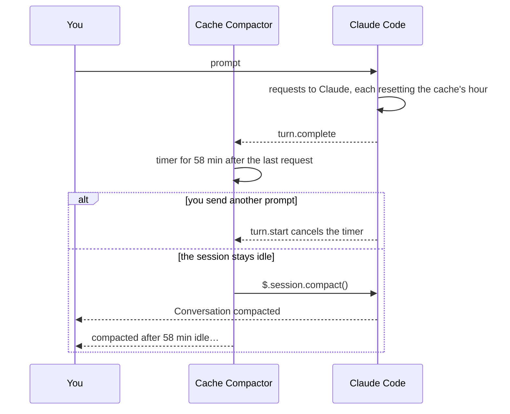

<h1 align="center"></h1>
<p align="center"><strong>Compacts an idle Claude Code session before its prompt cache goes stale.</strong></p>
<p align="center">
  
  
  
</p>
<p align="center"><a href="#install">Install</a> · <a href="#how-it-works">How it works</a> · <a href="#settings">Settings</a></p>

On a Claude subscription, Claude Code keeps your conversation in Anthropic's prompt cache for an hour, and every request resets that hour. Step away for longer and your next prompt sends the whole conversation again, written back to the cache at twice the normal input price.

Cache Compactor compacts the session two minutes before the cache expires, while compacting is still cheap:

- The hour counts from the session's last request, so every prompt and response pushes it back.
- It compacts once. If the last thing that happened was a compaction (yours, Claude Code's automatic one or its own), it waits for your next prompt.
- It says what it did: `compacted after 58 min idle, before the prompt cache expires: 152k → 9k tokens (48k read from the cache).`

This is an independent plugin, not an Anthropic product.

## Install

Needs Claude Code 2.1.294 or later.

```
/plugin marketplace add htxryan/claude-cache-compactor
/plugin install cache-compactor@claude-cache-compactor
```

To try it without installing: `claude --plugin-dir path/to/claude-cache-compactor`.

## Use

There's nothing to set up: it runs in every interactive session.

- **Turn it off for one session:** `/cache-compactor:off`. The status line shows `auto-compact off` until `/cache-compactor:on` turns it back on. It stays off when you resume that session; `/clear` starts the next conversation with it on.
- **See what's scheduled:** `/cache-compactor:status` says when the session will be compacted, or why it won't be, and what happened last time.
- **Small conversations are left alone:** under 30k tokens (the Messages row of `/context`), compacting costs about as much as it saves. See `minTokens`.
- **Only while Claude Code runs:** the timer lives in the Claude Code process. If the computer sleeps through the cache's last minutes, it wakes to an expired cache and leaves the session alone.
- **Resumed sessions** (`--continue`, `--resume`) count from their last response, so one resumed within the hour still gets compacted. One whose last event was a compaction waits for your next prompt.
- **Headless runs** (`claude -p`) are never compacted.

## How it works



**How long the cache lasts.** Claude Code uses [a one-hour cache on a Claude subscription and five minutes otherwise](https://code.claude.com/docs/en/prompt-caching). The plugin works out each session's cache by the same rules, in this order:

1. `DISABLE_PROMPT_CACHING` (or the variable for the session's model) turns caching off, and the plugin with it.
2. `FORCE_PROMPT_CACHING_5M`, then `CLAUDE_CODE_PROMPT_CACHE_TTL`, then the `promptCacheTtl` setting, then `ENABLE_PROMPT_CACHING_1H`.
3. Bedrock, Vertex and Foundry (`CLAUDE_CODE_USE_*`) use five minutes.
4. Otherwise, a Claude subscription is told by the plan's usage windows the last response reported: one hour, or five minutes once a window is past 100% and Claude Code draws on usage credits. With no plan windows, it's an API key: five minutes.

By default the plugin acts only on one-hour caches: on a five-minute cache it would compact after every short pause. Set `minCacheTtlSeconds` to `300` to take those sessions too. They then compact 5 minutes minus `leadSeconds` after each request: three minutes by default. To give an API-key session a one-hour cache, set Claude Code's own `promptCacheTtl` to `1h`; the plugin follows it.

## Settings

Set them in `/plugin` → cache-compactor, or in `~/.claude/settings.json`.

- **`minCacheTtlSeconds`:** the shortest prompt cache the plugin acts on at all: 3600 by default, so only one-hour caches. `300` or less also takes five-minute caches. It never changes when the plugin compacts, which is always the cache's lifetime minus `leadSeconds`.
- **`leadSeconds`:** how long before the cache expires to compact: 120 by default. It leaves time for the compaction's own request to start while the cache is warm.
- **`minTokens`:** conversations smaller than this are left alone: 30000 by default, measured like the Messages row of `/context`. `0` compacts every idle session.
- **`instructions`:** what the summary should keep, as you would type after `/compact`. Empty uses Claude Code's own.

```jsonc
{
  "pluginConfigs": {
    "cache-compactor@claude-cache-compactor": {
      "options": {
        "minCacheTtlSeconds": 3600, // act only on caches this long; 300 also takes five-minute ones
        "leadSeconds": 120,         // compact this long before the cache expires
        "minTokens": 30000,         // 0 compacts every idle session
        "instructions": ""          // e.g. "Keep the open TODOs and file paths."
      }
    }
  }
}
```

## Costs and limits

- **A compaction is a request.** It reads the system prompt and tools from the cache, but Claude Code sends the conversation itself uncached, then a summary comes back. That is why small conversations are skipped.
- **It pays off when you come back.** Your next prompt then re-caches a short summary instead of the whole conversation. If you never return to the session, the compaction was spent for nothing.
- **Compaction loses detail.** The summary replaces the conversation, as with `/compact`. `instructions` steers what it keeps.
- **A turn waiting on you** (a permission prompt, a question) is still running, so there is no compaction, and the cache can expire under it.
- **Updating or reloading the plugin mid-session** clears its timer until your next prompt.
- **Another plugin or a `PreCompact` hook can veto it.** It is skipped, and the next turn sets the timer again.

## What it hooks

The plugin is a mod: TypeScript in [hooks/register.ts](hooks/register.ts). Besides these events, it reads only Claude Code's prompt-caching variables (listed above), the `promptCacheTtl` setting, the session's model, its usage figures and, when a session is resumed, its transcript. In its own store it keeps the ids of sessions whose last event was a compaction, and of sessions you turned it off for. It sends nothing anywhere: its one request is the compaction, made by Claude Code.

- **`turn.start`:** cancels the timer while a turn runs.
- **`turn.step`:** notes when each main-conversation request starts. Subagents' requests have a cache of their own.
- **`turn.complete`:** sets the timer, counted from the turn's last request.
- **`session.compact`:** notes any compaction of the main conversation as the last thing that happened.
- **`classic.SessionStart`:** counts a resumed session from its last response, unless a compaction came after it.
- **`session.end`:** clears the timer on `/clear`.
- **`prompt.submit`:** names invalid settings, once.
- **`command.run`:** answers `/cache-compactor:status`, `:off` and `:on`.

```
claude plugin test .   # 40 tests
```

## Sources

- [How Claude Code uses prompt caching](https://code.claude.com/docs/en/prompt-caching): the TTLs, the variables and settings, and how `/compact` reads the cache.
- [Prompt caching](https://platform.claude.com/docs/en/build-with-claude/prompt-caching): cache writes cost 1.25× base input for five minutes and 2× for an hour, reads 0.1×.

---

<p align="center">Made with Claude by <a href="https://ryanhenderson.dev">Ryan Henderson</a></p>
